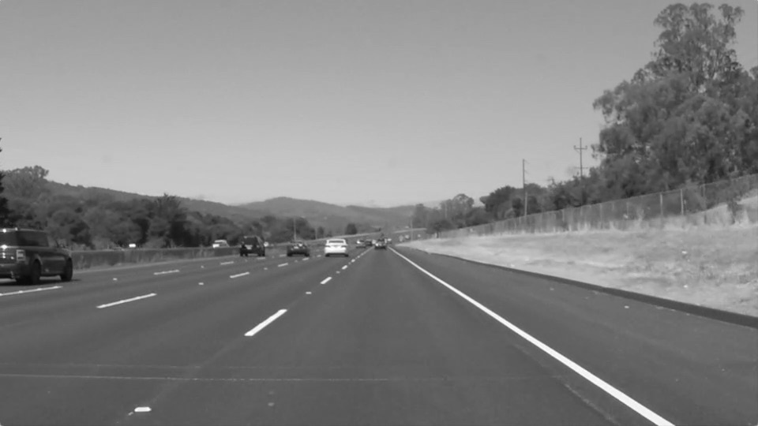

# **Finding Lane Lines on the Road** 
---

**Finding Lane Lines on the Road**

The goals / steps of this project are the following:
* Make a pipeline that finds lane lines on the road
* Reflect on your work in a written report

[//]: # (Image References)

[image1]: ./examples/grayscale.jpg "Grayscale"

---

### Reflection

### 1. Describe your pipeline. As part of the description, explain how you modified the draw_lines() function.

My pipeline consisted of one function 'draw_lane_lines(img)' with the parameter 'img' which is an array of image pixel([R][G][B]) and the return value as a processed image. 

The function 'draw_lane_lines()' consists of 10 functional steps, I'd like to describe each of steps  as below.

** In the first step, it converts image into gray-scale.

    ##### Step 1. Convert to gray-scale
    # from now on, I wiil use only gray scal image
    gray_img = grayscale(img)

** In the second, I've adjusted Gaussian smoothing with filter size '5'. 

    ##### Step 2. Gaussian smoothing
    temp_img = gaussian_blur(gray_img, 5)

** In the third, canny edge filter was processed with thresholds (30,100)
    
    ##### Step 3. Canny Edge
    temp_img = canny(temp_img, 30, 100)

** In the fourth step, I've tuned ROI area to fit our inputs. 

    ##### Step 4. ROI
    vertices = np.array([[(100,img_shape[0]),\
                          (img_shape[1]/2-90, img_shape[0]/2+80), \
                          (img_shape[1]/2+90, img_shape[0]/2+80), \
                          (img_shape[1]-30,img_shape[0])]], dtype=np.int32)
    mask_img = region_of_interest(temp_img, vertices)

** Within the ROI area, the hogh transform was conducted. I've write down my own code to deal with data fine, instead of using pre-defined helper function (hough_lines()).  Until this step, it is quite same as proposed one in the lecture. 
    
    ##### Step 5. Hough Transform
    rho =  1 # distance resolution in pixels of the Hough grid
    theta = (np.pi/180) # angular resolution in radians of the Hough grid
    threshold = 25   # minimum number of votes (intersections in Hough grid cell)
    min_line_len = 10 #minimum number of pixels making up a line
    max_line_gap = 50   # maximum gap in pixels between connectable line segments
    
    # Fragements hough_lines function to handle 'lines' more
    lines = cv2.HoughLinesP(mask_img, rho, theta, threshold, np.array([]), minLineLength=min_line_len, maxLineGap=max_line_gap)
    

** I've calculated 'slope' for each line, so that I can handle by positive/negative slopes seperately. 

    ##### Step 6. Calculate 'slope'(slope) of lines 
    lines_squeeze = np.squeeze(lines)
    # calculate 'slope'
    slope = np.arctan2(lines_squeeze[:,1]-lines_squeeze[:,3],-(lines_squeeze[:,0]-lines_squeeze[:,2]))*180.0/np.pi
    

** With 'slope' values, I've filtered out some noisy lines which have unlikey slope value. In the first, I've tried to filter out only near-horizonta/vertical lines, however, I've experienced better output with narrowing down allowed 'slope' range into '25~45' and '-45~-25'. 
 
    ##### Step 7. Take only possible candidates w.r.t slope value
    # -->  select lines with 25~45 and -45~-25 slope degree
    slope_filter_mask = (np.abs(slope)<25) \
                        | (np.abs(slope)>45)
    del_element=[]
    for i in range(len(slope_filter_mask)):
        if slope_filter_mask[i]:
            del_element.append(i)
    lines = np.delete(lines, del_element, axis=0)
    lines_squeeze = np.delete(lines_squeeze, del_element, axis=0)
    slope = np.delete(slope, del_element, axis=0)
 

** Divided lines into to groups, with positive/negative slopes

    ##### Step 8. Divide lines into positive/negative slope
    slope_positive = []
    slope_negative = []
    lines_positive = []
    lines_negative = []
    for i in range(len(slope)):
        if slope[i]>0:
            slope_positive.append(slope[i])
            lines_positive.append(lines_squeeze[i])
        else:
            slope_negative.append(slope[i])
            lines_negative.append(lines_squeeze[i])
    lines_positive = np.asarray(lines_positive)
    lines_negative = np.asarray(lines_negative)
    slope_positive = np.asarray(slope_positive)
    slope_negative = np.asarray(slope_negative)

** If the camera is installed on the right position, we can assume that lines with positive slope will be reside on the left-plane of image, and for negativie slope lines, on the right. With this filtering, I can remove lots of noisy lines in the 'challenge.mp4' 

    ##### Step 9. Throw away positive angle lines in right-plane ,  negative angle in left-plane
    # filter out positive lines in the right half of image
    filter_index=[]
    for i in range(len(lines_positive)):
        if((lines_positive[i][0]>(img_shape[1]/2)) | (lines_positive[i][2]>(img_shape[1]/2)) ):
            filter_index.append(i)
    slope_positive = np.delete(slope_positive, filter_index, axis=0)
    lines_positive = np.delete(lines_positive, filter_index, axis=0)
  
    # filter out negative lines in the left half of image
    filter_index=[]
    for i in range(len(lines_negative)):
        if ((lines_negative[i][0]<(img_shape[1]/2)) | (lines_negative[i][2]<(img_shape[1]/2)) ):
            filter_index.append(i)
    slope_negative = np.delete(slope_negative, filter_index, axis=0)
    lines_negative = np.delete(lines_negative, filter_index, axis=0)

Raw lines after this step is as below:  

    

** To average line segments, I've used a simple regression function from numpy api, np.polyfit(), for each positive/negative slope lines. With each regressed line, I've calculated top/bottom points of each line. (just picked at the bottom of image, and at the y=320) 

    ##### Step 10. Find averaged-lines with a simple regression function, and Choose top&bottom points. 
    # positivie
    avg_lines = np.empty([0,4], dtype=np.int)
    if len(lines_positive) > 1:
        global avg_lines
        positive_x = lines_positive[:,0]
        positive_x = np.append(positive_x,lines_positive[:,2])
        positive_y = lines_positive[:,1]
        positive_y = np.append(positive_y,lines_positive[:,3])
        deg_0, deg_1 = np.polyfit(positive_x, positive_y, 1)# y = deg_0*x + deg_1
        # find top & bottom points in the ROI
        pos_line = [0, img_shape[0]-1, 0, 320]
        pos_line[0] = int((pos_line[1]-deg_1)/deg_0)
        pos_line[2] = int((pos_line[3]-deg_1)/deg_0)
        # add a line!
        avg_lines = np.insert(avg_lines,0, pos_line, axis=0)
    # negative
    if len(lines_negative) > 1:
        global avg_lines
        negative_x = lines_negative[:,0]
        negative_x = np.append(negative_x,lines_negative[:,2])
        negative_y = lines_negative[:,1]
        negative_y = np.append(negative_y,lines_negative[:,3])
        deg_0, deg_1 = np.polyfit(negative_x, negative_y, 1)# y = deg_0*x + deg_1
        # find top & bottom points in the ROI
        neg_line = [0, img_shape[0]-1, 0, 320]
        neg_line[0] = int((neg_line[1]-deg_1)/deg_0)
        neg_line[2] = int((neg_line[3]-deg_1)/deg_0)
        # add a line!
        avg_lines = np.insert(avg_lines,0, neg_line, axis=0)

### 2. Identify potential shortcomings with your current pipeline

One potential shortcoming would be what would happen when ... 

Another shortcoming could be ...

### 3. Suggest possible improvements to your pipeline

A possible improvement would be to ...

Another potential improvement could be to ...

### Image Results

< solidWhiteCurve.jpg >

< solidYellowCurve.jpg >

< solidYellowCurve2.jpg >

< solidYellowLeft.jpg >

< whiteCarLaneSwitch.jpg >

< solidWhiteRight.jpg >

